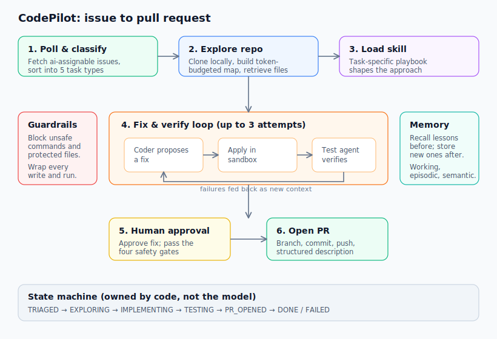

# CodePilot

An autonomous coding agent that turns GitHub issues into reviewed pull requests. It polls a repository for labelled issues, works out what kind of change each one needs, explores the codebase to find the right files, writes a fix, verifies it against the real test suite, and opens a pull request. A human approves at the moments that matter.

Built with the DeepAgents framework, LangGraph, and a Textual terminal interface.

## What it does

Give CodePilot a repository and a GitHub issue labelled `ai-assignable`, and it will:

1. Pull the issue and classify it (bug fix, feature, dependency update, documentation, or config change)
2. Clone the repo locally and build a compressed, searchable map of it
3. Retrieve the files most likely to matter for the task
4. Load a task-specific playbook (a "skill") that shapes how it approaches the change
5. Propose a fix, apply it in a sandbox, and run the test suite to verify it
6. Retry with the test failures as feedback if the first attempt does not pass
7. Recall lessons from past work on the repo and apply them
8. Ask a human to approve the fix and pass through safety gates
9. Open a real pull request with a structured description

Everything runs behind a live terminal interface that streams the agent's progress and prompts for approval when needed.

## Demo

[Add your screen recording link here]

Example pull requests opened by CodePilot on the test repository:

- [Link to a merged bug-fix PR]
- [Link to a merged documentation PR]

## Architecture



CodePilot is organized into subpackages that each own one concern:

```
src/codepilot/
├── core/          config, token counting, task state machine
├── github/        issue polling, classification, PR agent, approval gates
├── explorer/      local clone, repo map, file retrieval
├── agents/        coder, test agent, guardrails, skills, verify loop
├── memory/        working, episodic, and semantic memory
├── orchestration/ the orchestrator and the shared pipeline
└── ui/            the Textual interface
```

The task lifecycle is a state machine (`TRIAGED → EXPLORING → IMPLEMENTING → TESTING → PR_OPENED → DONE/FAILED`) owned by plain Python, not the language model. A model will happily report that it finished when it has not, so the code, not the model, decides what state a task is in.

### The interesting parts

**Context engineering.** A real repository has far too many files to fit in a context window. The Repo Map summarizes each file down to its path, language, exported symbols (extracted precisely using Python's `ast` module), and a one-line description, then packs as many summaries as fit inside a configurable token budget. It caches to disk keyed by commit SHA and rebuilds only when mapped files change.

**Two retrieval strategies.** Files are found either by keyword matching (fast, weights path and symbol hits above incidental overlap) or by embedding similarity through ChromaDB (semantic, uses a local model so no API key is needed). Both sit behind one interface.

**Verification against a baseline.** The test agent runs the suite before the coder touches anything and records which tests already fail. A task is judged on whether it introduces new failures, not on whether the whole suite is green. This stops an unrelated pre-existing bug from failing, say, a documentation task.

**Guardrails as pure functions.** Before the agent can run a shell command or write a file, deterministic checks block destructive commands (`rm -rf`, `curl`, `wget`, package installers, sandbox escapes) and protected files (`.git`, secrets, CI config, lockfiles). Safety does not depend on the model cooperating.

**Three tiers of memory.** Working memory is the per-task scratchpad. Episodic memory is a persistent log of past sessions, recalled by file or task type. Semantic memory distills a general lesson from each successful change ("this repo uses built-in types for hints, not the typing module") and retrieves the most relevant lessons for future tasks, so the system improves with use.

**Human-in-the-loop gates.** Four situations pause for approval: opening a PR against the main branch, a change touching more than five files, any push to the remote, and retrying after repeated failures.

## Setup

Requires Python 3.11+ and [uv](https://github.com/astral-sh/uv).

```bash
git clone <your-repo-url>
cd codepilot-agent
uv sync
```

Copy `.env.example` to `.env` and fill in:

```
CODEPILOT_MODEL=anthropic:claude-sonnet-4-5   # or an openai:/google_genai: model
ANTHROPIC_API_KEY=...                          # key matching your chosen model
GITHUB_TOKEN=...                               # classic token with `repo` scope
GITHUB_REPO=youruser/codepilot-playground      # the repo CodePilot works on
```

Create the practice repository CodePilot will operate on:

```bash
uv run python scripts/seed_playground.py
```

Then confirm everything is wired up:

```bash
uv run python scripts/smoke_test.py
```

## Usage

Launch the terminal interface:

```bash
uv run python scripts/run_tui.py
```

Select an issue and press Enter. Watch the agent work in the log panel, and approve the fix and the safety gates when prompted.

The pipeline can also be run headless for a single issue:

```bash
uv run python scripts/run_verify.py 1     # work issue #1 end to end
```

Other scripts (`run_explorer.py`, `run_coder.py`, `run_loop.py`) exercise individual stages and were used during development.

## Known limitations and design decisions

This was built as a focused project, and a few tradeoffs are worth being honest about.

**GitHub toolkit substitution.** The brief specified LangChain's `GitHubToolkit`. Its API wrapper hard-requires GitHub App authentication (an app ID and private key) with no personal-access-token path, and registering an App purely to read issues was disproportionate. CodePilot wraps PyGithub directly (which the toolkit itself uses underneath) and exposes the same operations. Everything GitHub-related goes through one client, so swapping in the literal toolkit would touch only that file.

**Tests run in CodePilot's environment.** The test agent runs the target repo's tests using CodePilot's own Python environment, so pytest and any test dependencies must be installed there. A production version would provision the target repo's dependencies in an isolated environment first.

**Episodic memory appends duplicates.** Working the same issue twice records two episodes. Semantic lessons overwrite (keyed by issue number), but the episodic log would benefit from deduplication in a longer-running system.

**Single-file focus.** The coder is tuned for small, surgical changes. Large multi-file refactors are outside its current scope.

## Tech stack

DeepAgents, LangGraph, LangChain, ChromaDB (local embeddings), PyGithub, Textual, pytest, uv.